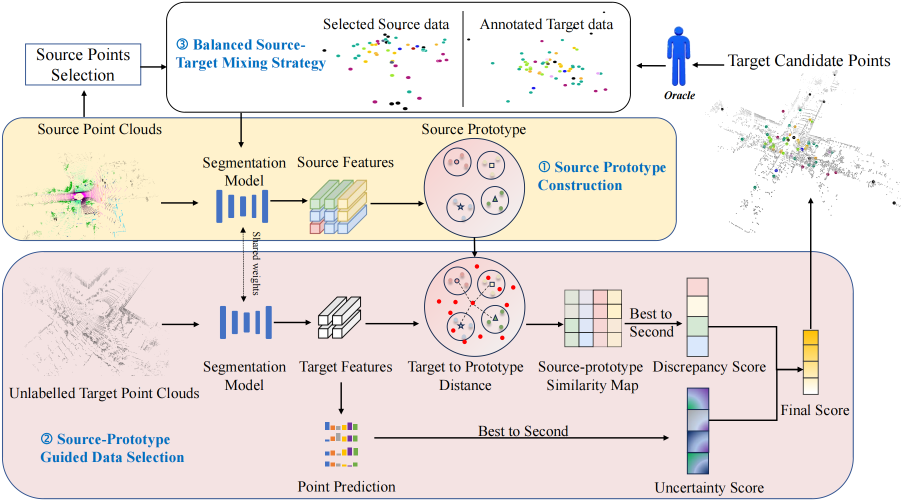

 ---

<div align="center">    
 
# Domain Discrepancy Aware Active Learning for Cross-domain LiDAR Point Cloud Segmentation

[Zongyi Xu](), [Jixiao Liu](), [Shanshan Zhao](), [Zhongpeng Lang](), [Qianni Zhang](), [Weisheng Li]() and [Xinbo Gao]()




</div>

### Highlight
- 🌈 We propose a domain discrepancy-aware active learning method, i.e. DDAL, for cross-domain point cloud semantic segmentation. Extensive experiments demonstrate that DDAL outperforms state-of-the-art approaches by a clear margin in synthetic-to-real and real-to-real benchmark.
- ⚖️ We propose a source-prototype-guided query strategy to measure the domain discrepancy based on the distance between target points and the centers of source categories representative target points are identified based on the measurement of domain discrepancy and the uncertainty predicted with the segmentation model. 
- 🚀 A balanced mixing technique, which adapts point cloud mixing to the ADA framework, is proposed and incorporated into the active learning process. This technique combines newly annotated target data with randomly selected source data at matching scales through mixed sampling, enabling more reliable domain-invariant feature learning.


## Usage
### Prerequisites
Please see [INSTALL.md](docs/INSTALL.md).

### Data Preparation
Please see [DATA.md](docs/DATA.md)

### Training and Evaluation
Please see [TRAIN_VAL.md](docs/TRAIN_VAL.md)


<!-- ## Citation
If you find this project useful in your research, please consider citing:
```latex
bib

``` -->

## Acknowledgements
This project is based on the [Annotator](https://github.com/BIT-DA/Annotator), we thank the author for making the source code publicly available.


## Contact

For help and issues associated with Annotator, or reporting a bug, please open a [[GitHub Issues](https://github.com/NoName5990/DDAL/issues/new)], or feel free to contact `S220201058@stu.cqupt.edu.cn`.
